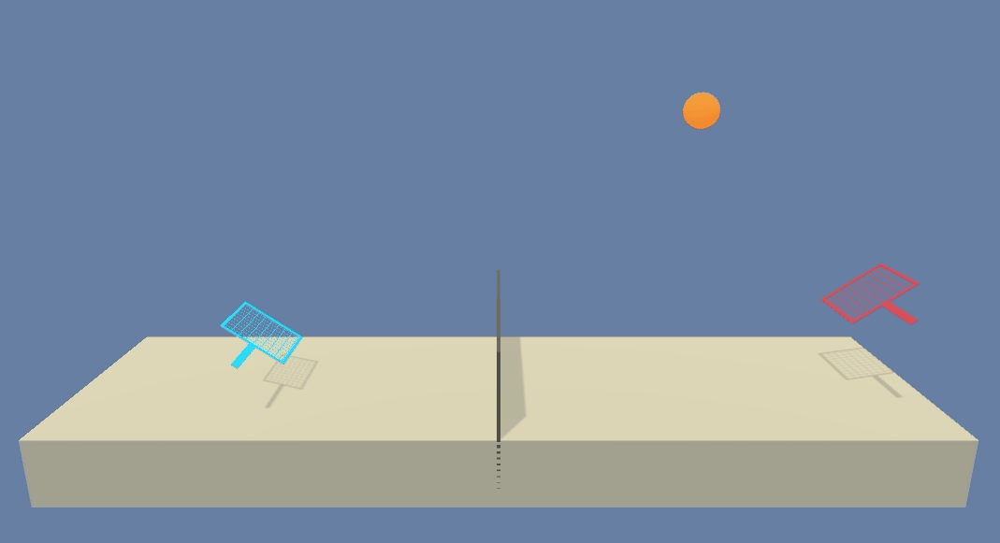

# Project 3: Collaboration and Competition

## Introduction

I trained two agents to control rackets to bound a ball over a net. The goal of each agent is to keep the ball in play.



*above: my trained agents*

The task is episodic. An agent receives a reward of +0.1 if it hits the ball over the net. If the ball hits the ground, the agent receives a reward of -0.01. The same is applies if the agent hits the ball out of bounds.

The observation space consists of 8 variables corresponding to the position and velocity of the ball and racket. Each agent receives its own, local observation. Two continuous actions are available, corresponding to movement toward (or away from) the net, and jumping.

The goal is to train the agents get an average score of +0.5 over 100 consecutive episodes (after taking the maximum over both agents).

## Getting Started

### Set up your python environment

1. Create and activate a new environment with Python 3.6.

	- __Linux__ or __Mac__:
	```bash
	conda create --name drl python=3.6
	source activate drl
	```
	- __Windows__:
	```bash
	conda create --name drl python=3.6
	activate drl
	```

2. Clone this repository and install the dependencies.
```bash
git clone https://github.com/AnKra/udacity-deep-reinforcement-learning-collaboation-and-competition-project.git
cd udacity-deep-reinforcement-learning-collaboation-and-competition-project/python
pip install .
cd ..
```

3. Create an [IPython kernel](http://ipython.readthedocs.io/en/stable/install/kernel_install.html) for the `drl` environment.  
```bash
python -m ipykernel install --user --name drl --display-name "drl"
```

### Set up the tennis environment

1. Download the environment from one of the links below.  You need only select the environment that matches your operating system:
    - Linux: [click here](https://s3-us-west-1.amazonaws.com/udacity-drlnd/P3/Tennis/Tennis_Linux.zip)
    - Mac OSX: [click here](https://s3-us-west-1.amazonaws.com/udacity-drlnd/P3/Tennis/Tennis.app.zip)
    - Windows (32-bit): [click here](https://s3-us-west-1.amazonaws.com/udacity-drlnd/P3/Tennis/Tennis_Windows_x86.zip)
    - Windows (64-bit): [click here](https://s3-us-west-1.amazonaws.com/udacity-drlnd/P3/Tennis/Tennis_Windows_x86_64.zip)

    (_For Windows users_) Check out [this link](https://support.microsoft.com/en-us/help/827218/how-to-determine-whether-a-computer-is-running-a-32-bit-version-or-64) if you need help with determining if your computer is running a 32-bit version or 64-bit version of the Windows operating system.

    (_For AWS_) If you'd like to train the agent on AWS (and have not [enabled a virtual screen](https://github.com/Unity-Technologies/ml-agents/blob/master/docs/Training-on-Amazon-Web-Service.md)), then please use [this link](https://s3-us-west-1.amazonaws.com/udacity-drlnd/P3/Tennis/Tennis_Linux_NoVis.zip) to obtain the "headless" version of the environment.  You will **not** be able to watch the agent without enabling a virtual screen, but you will be able to train the agent.  (_To watch the agent, you should follow the instructions to [enable a virtual screen](https://github.com/Unity-Technologies/ml-agents/blob/master/docs/Training-on-Amazon-Web-Service.md), and then download the environment for the **Linux** operating system above._)

2. Place the zip file your working copy of this repository and unzip it.


### Run the notebook

1. Open a notebook
```bash
jupyter notebook
```

2. Before running code in a notebook, change the kernel to match the `drl` environment by using the drop-down `Kernel` menu.

3. Follow the instructions in `Tennis.ipynb`
