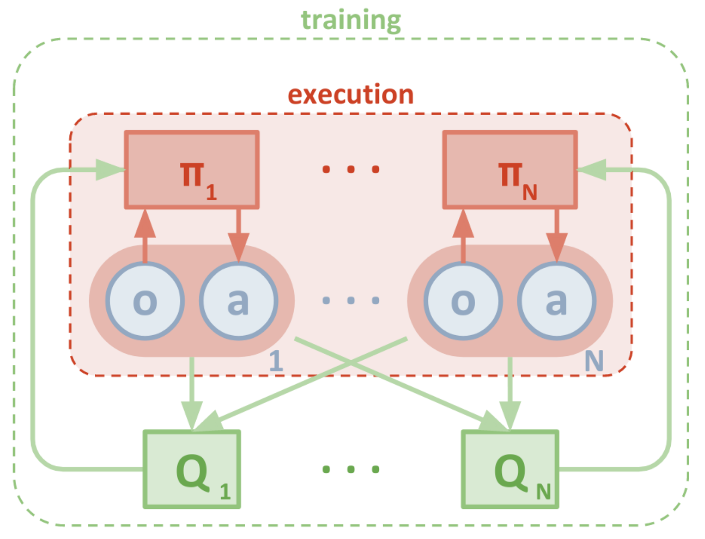
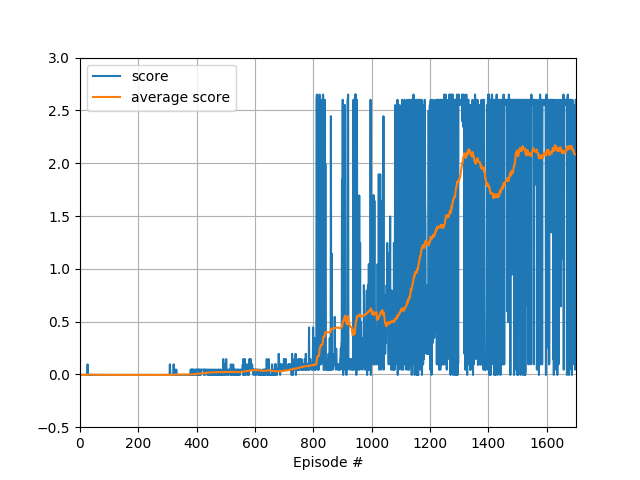
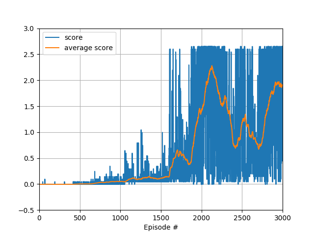

# Reinforcement Learning

## Multi-Agent Actor-Critic for Mixed Cooperative-Competitive Environments (MADDPG)
Multi-agent self-play has been shown to be a useful training paradigm.

In multi-agent environments, each agent's policy is changing as training progresses, resulting in a non-stationary environment. This prevents the naive use of experience replay and presents learning stability challenges.

MADDPG extends actor-critic policy gradient methods. The critic is centralized, i.e. it is trained with extra information about the decision-making policies of other agents (e.g. the observations of all agents, additional state information if available). Each agent has a centralized critic and each critic is learned separately. This allows the agents to have conflicting rewards which makes this approach applicable also in competitive settings.

In contrast to the critic, the actor receives only local information (i.e. its own observations) as input. After training only the local actors are used.

<figure class="image">
  
  <figcaption>Overview over MADDPG approach. π represents the policy learned by the actor, Q represents an approximation of the true action-value function learned by the critic. Source: [Multi-Agent Actor-Critic for Mixed Cooperative-Competitive Environments](https://arxiv.org/pdf/1706.02275.pdf)</figcaption>
</figure>

# Project 3 - Collaboration and Competition

## DDPG

### Learning Algorithm
The DDPG agent with which I solved Project 2 "Continuous Control" also works well for the tennis environment. I achieved an average score over the last 100 episodes of 1.75 in less than 1200 episodes with exactly the same parameter set.

I tuned the parameters by reducing the size of the fully connected layers by half and reducing the learning rate to 4e-4. Moreover I update the (local) actor and critic networks only once at a time (instead of 20 times in a row), using one sample (instead of 10 samples) from the replay buffer. With those changes the agent learns in a stable manner and achieves an average score of 2.16 over the last 100 episodes.

### Model Architecture
The primary actor network and the target actor network have identical architectures. The same is true for the primary critic network and the target critic network.

There is one agents which receives the observations of both agents as input.

#### Actor
```
Actor(
  (fc1): Linear(in_features=24, out_features=64, bias=True)
  (fc2): Linear(in_features=64, out_features=128, bias=True)
  (fc3): Linear(in_features=128, out_features=2, bias=True)
  (bn1): BatchNorm1d(64, eps=1e-05, momentum=0.1, affine=True, track_running_stats=True)
  (bn2): BatchNorm1d(128, eps=1e-05, momentum=0.1, affine=True, track_running_stats=True)
)
```
```
def forward(self, state):
    x = self.bn1(F.relu(self.fc1(state)))
    x = self.bn2(F.relu(self.fc2(x)))
    x = F.tanh(self.fc3(x))
    return x
```

#### Critic
```
Critic(
  (fcs1): Linear(in_features=24, out_features=256, bias=True)
  (fc2): Linear(in_features=258, out_features=128, bias=True)
  (fc3): Linear(in_features=128, out_features=1, bias=True)
)
```
```
def forward(self, state, action):
    xs = F.relu(self.fcs1(state))
    x = torch.cat((xs, action), dim=1)
    x = F.relu(self.fc2(x))
    x = self.fc3(x)
    return x
```

### Result
The agents achieve an average score of 2 (over 100 consecutive episodes, and over both agents) in less than 1300 episodes.



## MADDPG

### Learning Algorithm
The learning algorithm is based on the [MADDPG paper](https://arxiv.org/pdf/1706.02275.pdf). I instantiate two DDPG agents which receive observations from a central replay buffer.

The learning process is more instable than in the first approach due to the changing environment. To increase stability, in every step the Agent class takes 5 states, actions, rewards, next states and dones as input (one per agent) and outputs 5 actions. The side-effect of this setting is that one agent is able to have a lead over the other one and wins a match more often.

This approach seems to be very specific about a well-chosen learning rate. I tried to vary the learning rate slightly which results in the agents not learning at all.

### Model Architecture
In contrast to the first approach, there are two separate agents. Each agents has its own primary and target actor and critic. The actors only receive their own observations as input. The critics receive the observations of both agents as input. As a consequence the critics have twice as many input features as in the first approach.

#### Actor
```
Actor(
  (fc1): Linear(in_features=24, out_features=64, bias=True)
  (fc2): Linear(in_features=64, out_features=128, bias=True)
  (fc3): Linear(in_features=128, out_features=2, bias=True)
)
```

#### Critic
```
Critic(
  (fcs1): Linear(in_features=48, out_features=256, bias=True)
  (fc2): Linear(in_features=260, out_features=128, bias=True)
  (fc3): Linear(in_features=128, out_features=1, bias=True)
)
```

### Result
The agents achieve an average score of 2 (over 100 consecutive episodes, and over both agents) in less than 2100 episodes.



## Ideas for Improvement
* find better hyperparameters in an automated way
* implement Asynchronous Actor-Critic Agents (A3C) and compare with DDPG
* study [Benchmarking Deep Reinforcement Learning for Continuous Control](https://arxiv.org/pdf/1604.06778.pdf) and implement Trust Region Policy Optimization (TRPO) and Truncated Natural Policy Gradient (TNPG)
* implement Distributed Distributional Deterministic Policy Gradients (D4PG) and compare with DDPG
